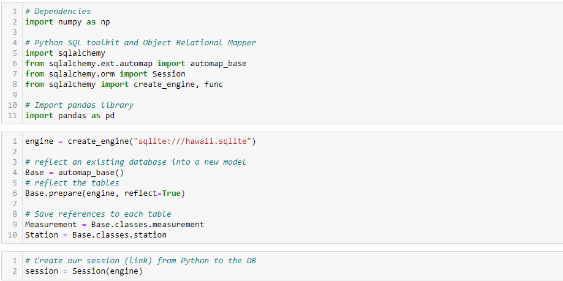
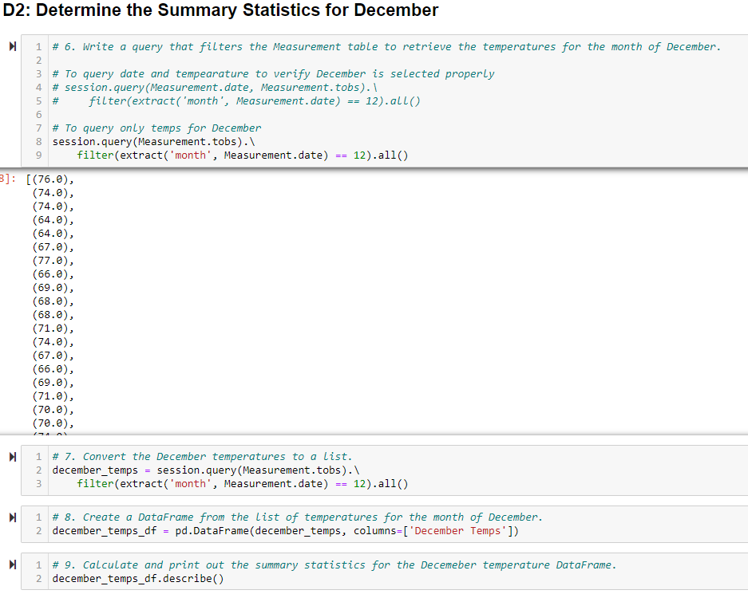

# Surfs Up Analysis

## Surfs Up Analysis Overview

This project utilized the Pandas, numpy, and sqlalchemy libraries in Python to analyze temperature data for the months of June and December on the Island of Oahu in preparation to open a combination ice cream and surf shop. The temperature data was contained in a sqlite database, and sqlalchemy was used to query that database for analysis. The analysis was performed to provide a potential investor, W. Avy, and his board of directors information needed to make an informed investment decision. Before making an investment in the ice cream and surf shop, the group wanted information on the year-round revenue potential of the shop, so temperature data for June and December were analyzed. The code for this project was developed in Jupyter Notebook using Python 3.8.8.

### Surfs Up Analysis Purpose

The overall purpose of this project was to continue to enhance students' Python skills and build upon the database knowledge gained in previous modules by introducing sqlalchemy and sqlite. A sqlite database was queried, and the results were loaded into Pandas dataframes to generate summary statistics. The module exercises also introduced students to Flask, where a web application was created to view analysis results.

## Surfs Up Analysis Results

To begin the analysis, the required libraries were imported as shown in Fig. 1. Notice the specific items imported from the sqlalchemy library to enable the analysis performed in this moduel. The *engine* variable was assigned to the sqlite database, the *automap_base()* function was used to map relationships to the sqlite database, and the *Base.prepare(engine, reflect=True)* line was used to reflect the database to a Python object. The measurement and station tables from the database were assigned to *Measurement* and *Station* variables for cleaner code later in the analysis. Finally, a query session was created with *session=Session(engine)* so that the database could be queried for analysis.

*Figure 1. Python dependencies*

With the session open, the database was queried to extract the June temperatures from the *Measurement* data as shown in Fig. 2. Notice that the *extract* functionality was imported from the sqlalchemy library. Extracting the June temperatures was accomplished with the extract function specifying the 'month' and setting it equal to '6'. The query results were saved to a list and then imported to a Pandas data frame to find summary statistics.

*Figure 2. Python code to query and analyze June temperatures*

The summary statistics for the June temperatures are shown in Fig. 3. From 1700 temperature observations, the mean temperature is found to be roughly 74.9°F with min and max temperatures of 64°F and 85°F, respectively. Further discussion of the summary statistics is outlined below.

*Figure 3. Summary statistics for June temperatures*

A similar query was written to extract the Decembers temperatures with the month set equal to '12' in the extract function. These results were also saved to a list and then imported to a Pandas data frame to find summary statistics.

*Figure 4. Python code to query and analyze December temperatures*

The summary statistics for the December temperatures are shown in Fig. 5. From 1517 temperature observations, the mean temperature is found to be roughly 71°F with min and max temperatures of 56°F and 83°F, respectively. Further discussion of the summary statistics is outlined below.

*Figure 5. Summary statistics for December temperatures*

The bulleted list below summarizes three key points from the results for June and December temperatures with respect to Figs. 3 and 5 above.

- One of the major items to note about the temperatures for June and December is the difference in the minimum temperature. The minimum temperature for June is 64°F, while the minimum temperature for December is 56°F. This may not have a major impact on surf sales for the two months, but it could have a significant impact on ice cream sales. The minimum June temperature is likely warm enough for customers to still purchase ice cream, but it is unlikely that customers would want ice cream with temperatures in the 50s.

- Another item to note is that the max temperatures are very close for the two months, with the June and December max temperatures measuring 85°F and 83°F, respectively. This indicates that the high temperature remains relatively constant, and fairly mild throughout the year. This bodes well for the surf shop indicating that the temperature will not become so hot that it is uncomfortable to be on the water surfing at any point throughout the year.

- It is also worthwhile to dive a little deeper in the summary statistics for June and December. The average temperatures for June and December are roughly 74.9°F and 71°F, respectively. The upper quartile for June is 77°F, and the lower quartile for June is 73°F. This puts the inner quartile range (IQR) for June at 4°F, and the threshold for outliers (using the IQR definition) at 83°F and 67°F. Therefore, the minimum observed temperature of 64°F could be an outlier, and the typical low temperature for June would not be expected to approach that level. Similarly, the upper quartile for December is 74°, and the lower quartile for December is 69°F resulting in an IQR of 5°F. Therefore, the threshold for outliers (using the IQR definition) is 81.5°F and 61.5°F, and the lowest observed temperature could be an outlier. Specifically for December, an expected minimum low temperature of 61.5°F could result in significantly more ice cream sales compared to temperatures in the mid-to-upper 50s.

## Surfs Up Analysis Summary

In summary, the temperature data for June and December indicates that there is not a significant difference in temperature throughout the year on the island of Oahu. There is less than 4°F difference in the average temperatures for June and December, and the thresholds for outliers are 83°F and 67°F for June and 81.5°F and 61.5°F for December. Although, it is expected that the lower temperatures in December may negatively impact ice cream sales, it does not appear from the analysis that the temperature would reach levels low enough to completely stop ice cream sales in December. Furthermore, the mild temperatures indicate that the weather is likely suitable for surfing year-round, and it is unlikely that the temperature would have a considerably negative impact on surf shop sales at any point in the year.

However, it is advisable that further analysis is performed to gain a more complete understanding of the weather on the island throughout the year. One additional query that could be performed to gain insight into Oahu weather that may impact revenue of the shop is one that investigates rainfall throughout the year. If there are seasons with particularly heavy and consistent rainfall, ice cream sales and surf sales could be impacted. Not only would this information be useful in determining whether or not to proceed with opening the shop, this information could also be pivotal in determining order quantities and inventory for particular seasons. Another query that would be useful in determining the validity of the surf and ice cream shop is one that investigates temperature data over other parts of the year and further breaks this down by the number of days in each month that are above or below certain temperatures. This information could be used to gain a more clear picture of anticipated sales, particularly ice cream sales, at different parts of the year. Furthermore, this could be coupled with ice cream sales data to determine correlations in ice cream sales with temperature. This would allow more concrete projections for ice cream sales at the shop. A similar exercise may be possible with other items in the surf shop to get ideas for revenue and inventory management.
